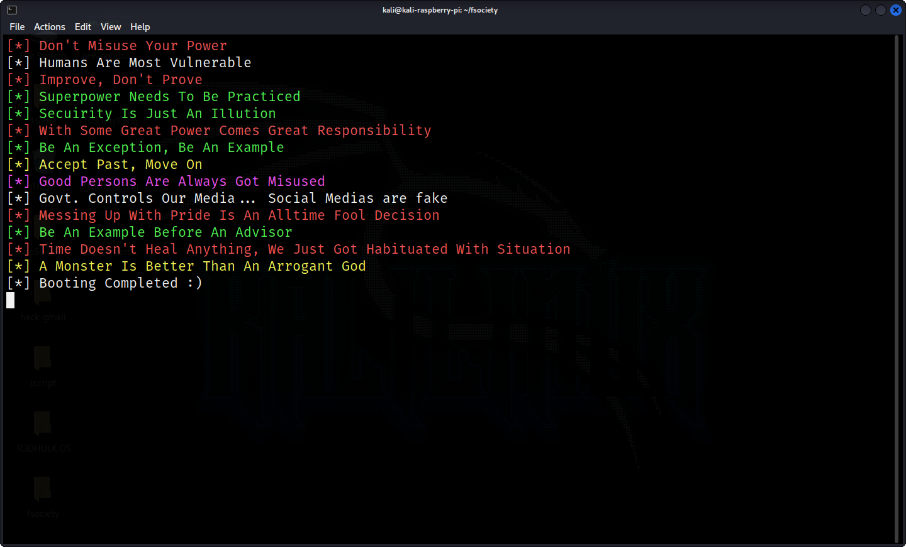
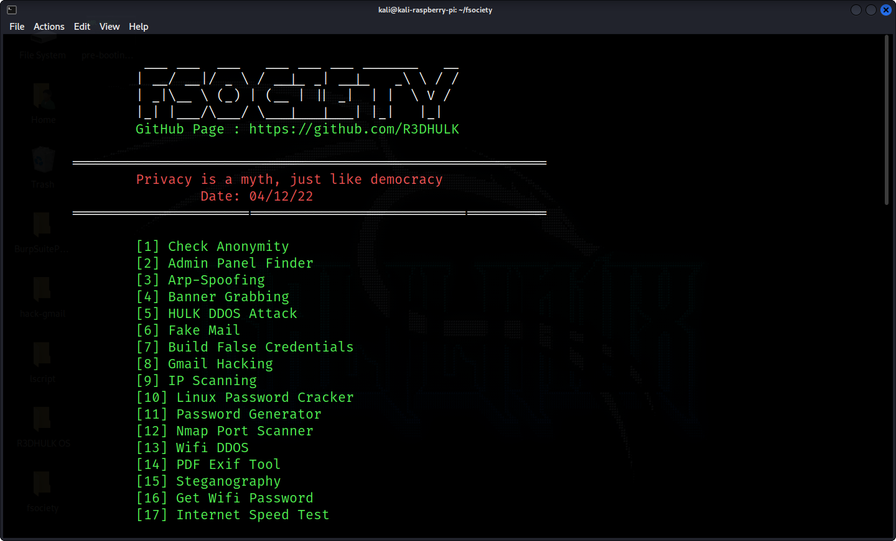
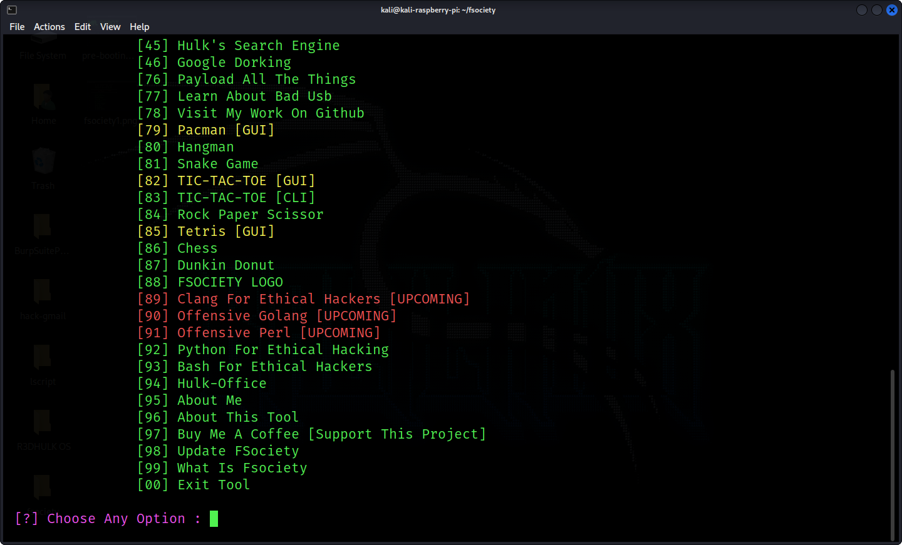
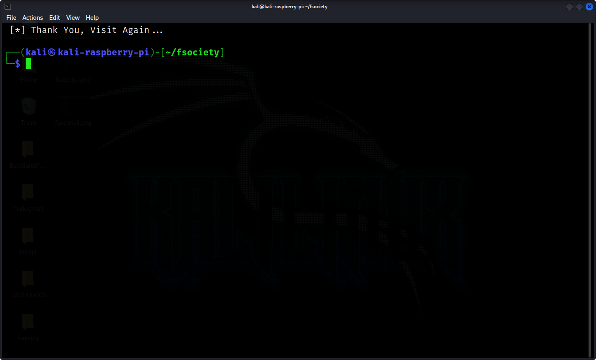

<h1><b>Fsociety ToolKit</h1><b>
<h2><b>Author :</b> Sumalya Chatterjee</h2>
<h2>Fsociety Is A Penetration Testing Toolkit Used In Mr. Robot Hacking Web Series. This show closely directed the real world hacking scenarioes. Although this whole tool almost contains my scripts on ethical hacking. </h2>


#
<h1><b><i> F**k Society </i></b></h1>
<h2><i><b> This Tool Is Only Available For Beta Testing. In Futures Many Tools And Features Will Get Add 😇😇😇. </i></b></h2><br>
<a href="https://git.io/typing-svg"></a><br></br>
   

#
<h2><b><i>Pre-Booting Screen :</h2></b></i>


#
<h2><b><i>Booting Screen :</h2></b></i>



#
<h2><b><i>Booted Screen :</h2></b></i>



#
<h2><b><i>Choose Options: </h2></b></i>



#
<h2><b><i>Exit Screen :</h2></b></i>



#
<h1><b>What Is Fsociety ?</h1></b>
<h2>Fsociety (also known as f*** society), is the name of a hacker group based in Coney Island, New York, led by the mysterious Mr. Robot. Its name is a play on both the derelict amusement park building in which it has its headquarters, and their message: "f**k society." </h2><br>
<br>

#
<h1><b>Background</b></h1>
<h3>The group is highly secretive, electing to meet and communicate in person, rather than through digital means which may be traceable. fsociety is responsible for the massive distributed denial of service (DDoS) attack that took E Corp offline before Elliot stopped them. After the attack ended, Elliot found a file left on one of the E Corp servers by fsociety. Rather than delete the file, Elliot changed the access permissions on the file to allow only himself access to it. Later, he was approached by Mr. Robot on the subway, and taken to Coney Island to see the group's headquarters. </h3>

#
<h1><b><u>Known Members :</u></b></h1>
<h2><b><u>Hackers :</h2></b></u><br>
<h3><i><b>Mr. Robot:</b> The group's leader, who is determined to draw Elliot into fsociety's activities. Mr. Robot is determined to bring down the world corporate structure, adopting a disguise much like the Monopoly Man when filming his video manifestos. He serves as a somewhat paternal figure to Elliot at times, refusing to leave him when he goes through withdrawal, and pushing Elliot beyond his normal boundaries.</h3></i><br>
<h3><i><b>Darlene:</b> An expert coder with few boundaries and little fear. She has little respect for others' privacy, including Elliot's, and generally says what she thinks. She has been involved with Cisco, a hacker associated with rival hacker group the Dark Army.</h3></i><br>
<h3><i><b>Leslie Romero (formerly):</b> The oldest of the group, who began as a phone phreaker. He is very experienced and world-wise. He helps Mr. Robot detox Elliot, and later walks away from the group for a time. Romero is murdered by a stray bullet from a neighborhood shooting a month after the 5/9 hack.</h3></i><br>
<h3><i><b>Sunil "Mobley" Markesh (formerly):</b> A young male hacker who works at the Bank of E. He becomes Darlene's closest advisor following the 5/9 hack, but soon becomes suspicious of both Darlene and Elliot after Romero's murder. Sometime after July 5, Mobley has moved west, and is working at an electronics store as "Frederick." He lives with Trenton and his friend.</h3></i><br>
<h3><i><b>Shama "Trenton" Biswas (formerly):</b> A young, quiet female hacker. Trenton was born to Iranian immigrant parents, and wears a hijab. She is a college student who questions her parents' values as assimilated Americans. Sometime after July 5, Trenton moved moved west with Mobley, no longer wears hijab, and is working at an electronics store as "Tanya." She lives with Mobley and his friend.</h3></i><br>

<br>

<h2><b><u>Associates</h2></b></u><br>

<h3><i><b>Cisco (Michael Drayer):</b> Darlene's off-and-on boyfriend, who is associated with the Dark Army. He brings the Dark Army into fsociety's plan to bring down E Corp by hacking Steel Mountain, only to tell Darlene they have bailed out. He is able to speak Mandarin Chinese.</h3></i><br>
<h3><i><b>Dark Army:</b> A mercenary hacker group associated with China. The Dark Army is the antithesis of fsociety, available to hack for hire, regardless of who they work for or what their cause is. Their leader is known as Whiterose.</h3></i><br>
<h3><i>A number of militants have joined after 5/9. These people, including Vincent Campbell, Ad Mitchell, Kevin Kerwick, and Kara Kirkland, were involved in stealing the balls from the Wall Street Bull statue and dropping it throught the roof the Capitol while Congress was voting on the E Corp bailout in July. The perpetrators are involved in a car chase with the police returning to NYC and crash. Three are captured while the aforementioned Vincent Campbell escapes to the smart house base, albeit gravely injured.
    The FBI believe there to be members overseas.</h3></i><br>
<h6>src=https://mrrobot.fandom.com/wiki/Fsociety</h6><br>


# 
<h3><b><i>🔴🔴🔴 This Framework Mostly Contains My Scripts On <a href="https://github.com/R3DHULK/python-for-ethical-hacking/"> Python For Ethical Hacking </a>Repo. And Every Tools I Used In This Framework Are Available Separately On My Github Account. 🔴🔴🔴</h3></b></i>

#
<h2><b>Git Installation: </h2></b>

``` 
# Install Python
sudo apt install python

# Install Git 
sudo apt install git

# Clone Project
git clone https://github.com/R3DHULK/fsociety

# Change Directory
cd fsociety

# Install Requirements
python3 -m pip install -r requirements.txt

# Run Command With Sudo Privileges
sudo python fsociety.py

```

#
<h1><b>💀💀💀 Run This Tool With Sudo Privileges 💀💀💀</h1></b>
<h2><b><i>-----Or Some Inbuilt Tool Can't Run Properly-----</i></b></h2>

# 
<h2><b>🔴 GUI Version Is For Desktop Users, Termux Doesn't Support GUI [It's Not An Error] 🔴</h2></b>

#
<h3><b>🎟️ You Want New Tools? Or Get Any Bugs? 🪲 </h3></b>
<h3><b>🎫 Feel Free To Start <a href='https://github.com/R3DHULK/fsociety/issues'>Issue. 🎫</a>

#

